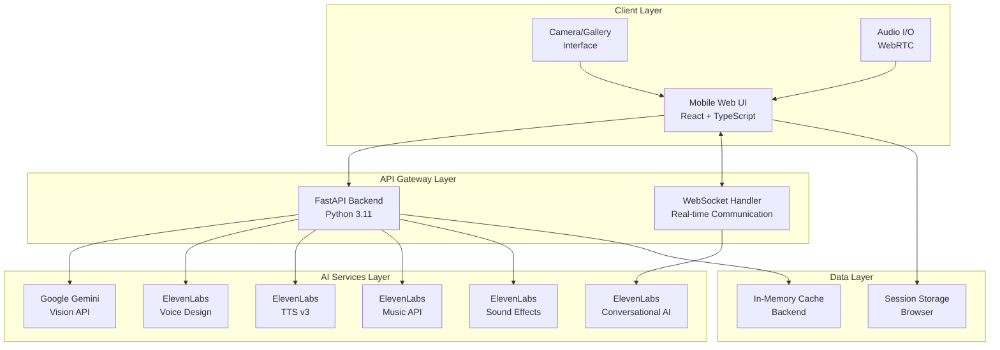

# Technical Design Document

## Overview

VoiceSnap is a mobile web application that transforms photographed objects into interactive AI characters with unique personalities and voices. The system combines computer vision, natural language processing, and advanced voice synthesis to create immersive conversational experiences.

### Core Capabilities

- **Photo Analysis**: Uses Google Gemini Vision API to identify objects and living things in photographs
- **Personality Generation**: Creates unique character profiles with names, traits, and backstories
- **Voice Synthesis**: Generates custom voices using ElevenLabs Voice Design API with 6 style options
- **Real-time Conversation**: Enables natural voice interactions through ElevenLabs Conversational AI
- **Musical Performance**: Creates and performs songs using ElevenLabs Music API
- **Ambient Audio**: Generates contextual sound effects for immersive experiences

### Technology Stack

**Frontend**: React 18 + Vite + TypeScript + Tailwind CSS
**Backend**: FastAPI (Python 3.11+) with WebSocket support
**AI Services**: ElevenLabs APIs (Voice Design, TTS v3, Conversational AI, Sound Effects, Music)
**Vision API**: Google Gemini Vision for object identification
**Deployment**: Render platform for both frontend and backend services

## Architecture

### System Architecture Diagram



### Component Architecture

The application follows a layered architecture with clear separation of concerns:

1. **Presentation Layer**: React components with TypeScript for type safety
2. **API Layer**: FastAPI with automatic OpenAPI documentation
3. **Service Layer**: Abstracted AI service integrations
4. **Data Layer**: Session-based storage with in-memory caching

### Data Flow

1. **Photo Capture**: User captures/uploads photo → Frontend validates format → Sends to backend
2. **Object Analysis**: Backend sends image to Gemini Vision → Receives object identification
3. **Character Creation**: Backend generates personality traits and backstory → Creates voice profile
4. **Voice Interaction**: WebSocket connection enables real-time conversation with ElevenLabs
5. **Content Generation**: On-demand song and ambient sound generation

## Components and Interfaces

### Frontend Components

#### Core Screen Components

**HomeScreen** (`src/components/screens/HomeScreen.tsx`)
- Camera capture interface with "Snap & Meet" button
- Gallery upload option
- Responsive design with mobile-first approach
- Image format validation (JPEG, PNG, WebP)

**LoadingScreen** (`src/components/screens/LoadingScreen.tsx`)
- Displays captured photo with loading animation
- Cycles through status messages: "Discovering what you found...", "Crafting its personality...", "Designing its voice..."
- Progress indication with smooth transitions
- "Awakening..." primary message

**MeetObjectScreen** (`src/components/screens/MeetObjectScreen.tsx`)
- Object profile display with generated emoji
- Character name and species information
- 3 personality trait badges
- Backstory paragraph
- Voice selection interface (6 options: Mysterious, Warm, Wise, Playful, Dramatic, Whispery)
- TALK and SING action buttons

**VoiceConversationScreen** (`src/components/screens/VoiceConversationScreen.tsx`)
- Hold-to-speak microphone button
- Real-time conversation transcript with scrolling
- Object speaking status with pulse animation
- Ambient sound controls
- WebSocket connection management

**SingingScreen** (`src/components/screens/SingingScreen.tsx`)
- Synchronized lyrics display
- Music notes animation around object emoji
- Audio player controls (play, pause, seek)
- "Request another song" button
- Song duration display (30-90 seconds)

#### Shared Components

**Button** (`src/components/ui/Button.tsx`)
```typescript
interface ButtonProps {
  variant: 'primary' | 'secondary' | 'ghost';
  size: 'sm' | 'md' | 'lg';
  children: React.ReactNode;
  onClick?: () => void;
  disabled?: boolean;
  className?: string;
}
```

**Card** (`src/components/ui/Card.tsx`)
```typescript
interface CardProps {
  children: React.ReactNode;
  className?: string;
  glowEffect?: boolean;
}
```

**LoadingSpinner** (`src/components/ui/LoadingSpinner.tsx`)
```typescript
interface LoadingSpinnerProps {
  size: 'sm' | 'md' | 'lg';
  color?: string;
}
```

### Backend Components

#### API Endpoints

**Photo Analysis Service** (`src/services/photo_analyzer.py`)
```python
class PhotoAnalyzer:
    async def identify_object(self, image_data: bytes) -> ObjectIdentification:
        """Identifies primary object using Gemini Vision API"""
        
    async def extract_characteristics(self, identification: ObjectIdentification) -> List[str]:
        """Extracts descriptive characteristics for personality generation"""
```

**Personality Generator** (`src/services/personality_generator.py`)
```python
class PersonalityGenerator:
    async def generate_profile(self, object_type: str, characteristics: List[str]) -> ObjectProfile:
        """Creates complete character profile with name, traits, and backstory"""
        
    def generate_name(self, object_type: str) -> str:
        """Generates contextually appropriate character name"""
        
    def generate_traits(self, object_type: str, characteristics: List[str]) -> List[str]:
        """Creates exactly 3 personality trait badges"""
        
    def generate_backstory(self, name: str, traits: List[str]) -> str:
        """Creates engaging backstory paragraph"""
```

**Voice Designer** (`src/services/voice_designer.py`)
```python
class VoiceDesigner:
    async def create_voice(self, profile: ObjectProfile, style: VoiceStyle) -> VoiceConfig:
        """Generates unique voice using ElevenLabs Voice Design API"""
        
    async def get_voice_options(self) -> List[VoiceStyle]:
        """Returns 6 available voice styles"""
```

**Conversation Engine** (`src/services/conversation_engine.py`)
```python
class ConversationEngine:
    async def start_conversation(self, profile: ObjectProfile, voice_config: VoiceConfig) -> str:
        """Initiates WebSocket conversation session"""
        
    async def process_user_input(self, audio_data: bytes, session_id: str) -> ConversationResponse:
        """Processes user speech and generates AI response"""
        
    async def generate_speech(self, text: str, voice_config: VoiceConfig) -> bytes:
        """Converts text to speech using selected voice"""
```

#### WebSocket Handler

**Real-time Communication** (`src/websocket/conversation_handler.py`)
```python
class ConversationWebSocket:
    async def connect(self, websocket: WebSocket, session_id: str):
        """Establishes WebSocket connection for real-time conversation"""
        
    async def handle_audio_input(self, audio_data: bytes):
        """Processes incoming audio and sends AI response"""
        
    async def send_response(self, response: ConversationResponse):
        """Sends AI-generated audio response to client"""
```

### Data Models

#### Core Data Structures

```typescript
// Frontend TypeScript Interfaces

interface ObjectIdentification {
  objectType: string;
  species?: string;
  characteristics: string[];
  confidence: number;
}

interface ObjectProfile {
  id: string;
  name: string;
  species: string;
  emoji: string;
  traits: string[]; // Exactly 3 traits
  backstory: string;
  voiceConfig?: VoiceConfig;
}

interface VoiceConfig {
  voiceId: string;
  style: VoiceStyle;
  settings: {
    stability: number;
    similarityBoost: number;
    style: number;
  };
}

interface ConversationMessage {
  id: string;
  speaker: 'user' | 'object';
  content: string;
  timestamp: Date;
  audioUrl?: string;
}

interface Song {
  id: string;
  title: string;
  lyrics: string;
  audioUrl: string;
  duration: number; // 30-90 seconds
}
```

```python
# Backend Python Models

from pydantic import BaseModel
from typing import List, Optional
from enum import Enum

class VoiceStyle(str, Enum):
    MYSTERIOUS = "mysterious"
    WARM = "warm"
    WISE = "wise"
    PLAYFUL = "playful"
    DRAMATIC = "dramatic"
    WHISPERY = "whispery"

class ObjectIdentification(BaseModel):
    object_type: str
    species: Optional[str] = None
    characteristics: List[str]
    confidence: float

class ObjectProfile(BaseModel):
    id: str
    name: str
    species: str
    emoji: str
    traits: List[str]  # Exactly 3 traits
    backstory: str
    voice_config: Optional['VoiceConfig'] = None

class VoiceConfig(BaseModel):
    voice_id: str
    style: VoiceStyle
    settings: dict

class ConversationResponse(BaseModel):
    text: str
    audio_url: str
    session_id: str
    timestamp: float
```

## Data Models

### Session Management

The application uses session-based data management with the following storage strategy:

**Frontend Session Storage**:
- Current object profile and conversation history
- Voice configuration and preferences
- UI state and navigation history

**Backend In-Memory Cache**:
- Active WebSocket connections
- Conversation context and history
- Generated voice configurations
- Temporary audio file storage

### Data Persistence Strategy

Since VoiceSnap is designed as a session-based experience, data persistence follows these principles:

1. **Temporary Storage**: All generated content (voices, conversations, songs) stored temporarily
2. **Session Lifecycle**: Data cleared when user starts new session or closes app
3. **Performance Optimization**: Frequently accessed data cached in memory
4. **Privacy Focus**: No permanent storage of user photos or conversations

### API Response Formats

All API endpoints return consistent JSON responses:

```json
{
  "success": boolean,
  "data": object | null,
  "error": {
    "code": string,
    "message": string
  } | null,
  "timestamp": string
}
```

## Error Handling

### Frontend Error Handling

**Network Errors**:
- Automatic retry with exponential backoff
- User-friendly error messages
- Graceful degradation for offline scenarios

**Validation Errors**:
- Real-time form validation
- Clear error messaging
- Prevention of invalid submissions

**WebSocket Errors**:
- Automatic reconnection attempts
- Connection status indicators
- Fallback to HTTP polling if needed

### Backend Error Handling

**API Integration Errors**:
```python
class APIError(Exception):
    def __init__(self, service: str, status_code: int, message: str):
        self.service = service
        self.status_code = status_code
        self.message = message

class ElevenLabsError(APIError):
    """Specific error handling for ElevenLabs API issues"""

class GeminiError(APIError):
    """Specific error handling for Google Gemini API issues"""
```

**Rate Limiting**:
- Implement exponential backoff for API calls
- Queue management for high-volume requests
- User notification for service limitations

**Validation Errors**:
- Pydantic model validation
- Custom validators for business logic
- Detailed error responses with field-level feedback

### Error Recovery Strategies

1. **Photo Analysis Failure**: Allow photo retake with improved guidance
2. **Voice Generation Failure**: Provide default voice options
3. **Conversation Interruption**: Maintain context and resume capability
4. **Network Interruption**: Local caching and sync when reconnected
## Testing Strategy

### Testing Approach Overview

VoiceSnap employs a comprehensive testing strategy that combines unit tests, integration tests, and property-based testing where applicable. The testing approach focuses on ensuring reliability across AI service integrations, real-time communication, and mobile user experience.

### Frontend Testing

**Unit Tests** (Jest + React Testing Library):
- Component rendering and user interactions
- State management and data flow
- Audio/video capture functionality
- WebSocket connection handling
- Form validation and error states

**Integration Tests**:
- API endpoint integration
- WebSocket communication flows
- Audio playback and recording
- Camera and gallery access
- Cross-browser compatibility (Safari, Chrome)

**Visual Testing**:
- Component snapshot tests for UI consistency
- Responsive design validation across screen sizes
- Animation and transition testing

### Backend Testing

**Unit Tests** (pytest):
- Individual service functions and methods
- Data model validation and serialization
- Business logic for personality generation
- Error handling and edge cases
- API request/response formatting

**Integration Tests**:
- ElevenLabs API integration endpoints
- Google Gemini Vision API integration
- WebSocket connection management
- End-to-end conversation flows
- File upload and processing

**Performance Tests**:
- API response time validation (< 2s for UI, < 10s for photo processing, < 5s for voice generation)
- WebSocket connection stability under load
- Memory usage during audio processing
- Concurrent user session handling

### AI Service Integration Testing

**Mock-Based Testing**:
- ElevenLabs API responses with various scenarios
- Google Gemini Vision API edge cases
- Rate limiting and error response handling
- Service unavailability scenarios

**Contract Testing**:
- API schema validation for all external services
- Response format consistency checks
- Authentication and authorization flows

### Property-Based Testing Assessment

VoiceSnap includes several areas suitable for property-based testing, particularly around data transformation, validation, and business logic. The following components will benefit from property-based testing:

- **Personality Generation**: Universal properties around trait generation and backstory creation
- **Voice Configuration**: Properties ensuring voice settings remain within valid ranges
- **Conversation Context**: Properties maintaining conversation state consistency
- **Audio Processing**: Properties for audio format validation and conversion

Property-based tests will use Hypothesis (Python) for backend testing and fast-check (TypeScript) for frontend testing, with minimum 100 iterations per property test.

### Test Configuration

**Frontend Test Setup**:
```json
{
  "testEnvironment": "jsdom",
  "setupFilesAfterEnv": ["<rootDir>/src/test/setup.ts"],
  "moduleNameMapping": {
    "^@/(.*)$": "<rootDir>/src/$1"
  },
  "collectCoverageFrom": [
    "src/**/*.{ts,tsx}",
    "!src/**/*.d.ts",
    "!src/test/**"
  ]
}
```

**Backend Test Setup**:
```python
# pytest.ini
[tool:pytest]
testpaths = tests
python_files = test_*.py
python_classes = Test*
python_functions = test_*
addopts = --cov=src --cov-report=html --cov-report=term-missing
```

### Continuous Integration

**GitHub Actions Workflow**:
- Automated testing on pull requests
- Cross-browser testing for frontend
- API integration testing with mock services
- Performance regression testing
- Security vulnerability scanning

**Quality Gates**:
- Minimum 80% code coverage
- All tests must pass
- No high-severity security vulnerabilities
- Performance benchmarks must be met
## Correctness Properties

*A property is a characteristic or behavior that should hold true across all valid executions of a system-essentially, a formal statement about what the system should do. Properties serve as the bridge between human-readable specifications and machine-verifiable correctness guarantees.*

### Property 1: File Format Validation

*For any* uploaded file, the system SHALL accept the file if and only if it has a valid image format (JPEG, PNG, WebP) and reject all other formats with appropriate error messaging.

**Validates: Requirements 1.5**

### Property 2: API Response Parsing Completeness

*For any* valid Google Gemini Vision API response, the Photo_Analyzer SHALL successfully extract object type, species (when present), and descriptive characteristics without data loss.

**Validates: Requirements 2.3**

### Property 3: Complete Object Profile Generation

*For any* identified object type and characteristics, the Personality_Generator SHALL create a complete ObjectProfile containing a non-empty name, exactly 3 personality traits, a non-empty backstory paragraph, and all required species/type information.

**Validates: Requirements 3.1, 3.2, 3.3, 3.4**

### Property 4: Voice Configuration Session Persistence

*For any* valid voice configuration, when stored in a session, the configuration SHALL be retrievable with identical settings throughout the session lifecycle.

**Validates: Requirements 4.5**

### Property 5: Conversation Display Completeness

*For any* conversation message history, the User_Interface SHALL display all messages in chronological order with proper speaker identification and scrolling capability.

**Validates: Requirements 5.6**

### Property 6: Conversation Context Preservation

*For any* sequence of conversation interactions within a session, the Conversation_Engine SHALL maintain context such that later responses can reference earlier conversation elements.

**Validates: Requirements 5.8**

### Property 7: Audio Volume Relationship Consistency

*For any* combination of speech audio and ambient sound effects, the ambient sounds SHALL always be played at a lower volume than speech to ensure speech clarity.

**Validates: Requirements 6.4**

### Property 8: Song Content Generation Completeness

*For any* object personality profile, the Music_Generator SHALL create song lyrics that are non-empty, contextually appropriate, and formatted for display synchronization.

**Validates: Requirements 7.1**

### Property 9: Lyrics Synchronization Accuracy

*For any* generated song with lyrics, the User_Interface SHALL display lyrics synchronized with audio playback such that each lyric line appears at the correct timestamp.

**Validates: Requirements 7.3**

### Property 10: Song Duration Constraint Compliance

*For any* generated song, the duration SHALL always be between 30 and 90 seconds inclusive, regardless of lyrics length or object type.

**Validates: Requirements 7.7**

### Property 11: Progress Indication Universality

*For any* processing stage in the application, the User_Interface SHALL provide visual progress indication that accurately reflects the current processing state.

**Validates: Requirements 8.4**

### Property 12: Button Dimension Compliance

*For any* button component in the User_Interface, the button SHALL have a minimum height of 44px and border radius of 14px to meet accessibility and design requirements.

**Validates: Requirements 9.3**

### Property 13: Interactive Element Effect Consistency

*For any* interactive UI element, the system SHALL apply green glow effects consistently to provide visual feedback for user interactions.

**Validates: Requirements 9.6**

### Property 14: Comprehensive API Error Handling

*For any* API endpoint and any error condition (network failure, rate limiting, invalid input, service unavailability), the system SHALL return appropriate HTTP status codes and structured error responses without system crashes.

**Validates: Requirements 10.8, 11.6**

### Property 15: Authentication Header Universality

*For any* ElevenLabs API call made by the system, the request SHALL include proper authentication headers regardless of the specific API endpoint or request parameters.

**Validates: Requirements 11.7**

### Property 16: Network Interruption Recovery

*For any* network interruption scenario during active operations, the system SHALL implement recovery mechanisms that restore functionality when connectivity is reestablished without data loss.

**Validates: Requirements 12.6**
## Implementation Details

### Frontend Implementation

**Technology Stack**:
- React 18 with TypeScript for type safety and modern React features
- Vite for fast development and optimized builds
- Tailwind CSS for utility-first styling and responsive design
- React Router for client-side navigation
- Zustand for lightweight state management
- React Query for API state management and caching

**Key Implementation Considerations**:

**Audio Handling**:
```typescript
// WebRTC integration for real-time audio
const audioContext = new AudioContext();
const mediaRecorder = new MediaRecorder(stream, {
  mimeType: 'audio/webm;codecs=opus'
});

// Audio playback with proper cleanup
const playAudio = async (audioUrl: string) => {
  const audio = new Audio(audioUrl);
  audio.addEventListener('ended', cleanup);
  await audio.play();
};
```

**WebSocket Management**:
```typescript
class ConversationWebSocket {
  private ws: WebSocket | null = null;
  private reconnectAttempts = 0;
  private maxReconnectAttempts = 5;

  connect(sessionId: string) {
    this.ws = new WebSocket(`wss://api.voicesnap.app/ws/conversation?session=${sessionId}`);
    this.setupEventHandlers();
  }

  private handleReconnection() {
    if (this.reconnectAttempts < this.maxReconnectAttempts) {
      setTimeout(() => this.connect(this.sessionId), 1000 * Math.pow(2, this.reconnectAttempts));
      this.reconnectAttempts++;
    }
  }
}
```

**Camera Integration**:
```typescript
const capturePhoto = async (): Promise<File> => {
  const stream = await navigator.mediaDevices.getUserMedia({ 
    video: { facingMode: 'environment' } 
  });
  const video = document.createElement('video');
  video.srcObject = stream;
  
  // Capture frame to canvas and convert to blob
  const canvas = document.createElement('canvas');
  const ctx = canvas.getContext('2d');
  ctx.drawImage(video, 0, 0);
  
  return new Promise(resolve => {
    canvas.toBlob(resolve, 'image/jpeg', 0.8);
  });
};
```

### Backend Implementation

**FastAPI Application Structure**:
```python
from fastapi import FastAPI, WebSocket, UploadFile, HTTPException
from fastapi.middleware.cors import CORSMiddleware
import asyncio
import logging

app = FastAPI(title="VoiceSnap API", version="1.0.0")

# CORS configuration for frontend
app.add_middleware(
    CORSMiddleware,
    allow_origins=["https://voicesnap.app"],
    allow_credentials=True,
    allow_methods=["*"],
    allow_headers=["*"],
)

# Dependency injection for services
@app.dependency
async def get_photo_analyzer() -> PhotoAnalyzer:
    return PhotoAnalyzer(gemini_api_key=settings.GEMINI_API_KEY)

@app.dependency  
async def get_elevenlabs_client() -> ElevenLabsClient:
    return ElevenLabsClient(api_key=settings.ELEVENLABS_API_KEY)
```

**Service Layer Architecture**:
```python
class ElevenLabsClient:
    def __init__(self, api_key: str):
        self.api_key = api_key
        self.base_url = "https://api.elevenlabs.io/v1"
        self.session = aiohttp.ClientSession()
    
    async def create_voice(self, profile: ObjectProfile, style: VoiceStyle) -> VoiceConfig:
        """Generate unique voice using Voice Design API"""
        payload = {
            "text": f"Hello, I'm {profile.name}",
            "voice_description": self._generate_voice_description(profile, style)
        }
        
        async with self.session.post(
            f"{self.base_url}/voice-generation/generate-voice",
            headers={"xi-api-key": self.api_key},
            json=payload
        ) as response:
            if response.status == 200:
                data = await response.json()
                return VoiceConfig(
                    voice_id=data["voice_id"],
                    style=style,
                    settings=data["settings"]
                )
            else:
                raise ElevenLabsError("Voice generation failed", response.status)
```

**WebSocket Implementation**:
```python
class ConversationManager:
    def __init__(self):
        self.active_connections: Dict[str, WebSocket] = {}
        self.conversation_contexts: Dict[str, ConversationContext] = {}
    
    async def connect(self, websocket: WebSocket, session_id: str):
        await websocket.accept()
        self.active_connections[session_id] = websocket
        
    async def handle_conversation(self, session_id: str, audio_data: bytes):
        # Process audio with ElevenLabs Conversational AI
        context = self.conversation_contexts.get(session_id)
        response = await self.elevenlabs_client.process_conversation(
            audio_data, context
        )
        
        # Send response back to client
        await self.send_response(session_id, response)
```

### Deployment Configuration

**Frontend Deployment (Render Static Site)**:
```yaml
# render.yaml
services:
  - type: web
    name: voicesnap-frontend
    env: static
    buildCommand: npm run build
    staticPublishPath: ./dist
    envVars:
      - key: VITE_API_URL
        value: https://voicesnap-api.onrender.com
```

**Backend Deployment (Render Web Service)**:
```yaml
services:
  - type: web
    name: voicesnap-api
    env: python
    buildCommand: pip install -r requirements.txt
    startCommand: uvicorn main:app --host 0.0.0.0 --port $PORT
    envVars:
      - key: ELEVENLABS_API_KEY
        sync: false
      - key: GEMINI_API_KEY
        sync: false
```

**Environment Configuration**:
```python
# settings.py
from pydantic import BaseSettings

class Settings(BaseSettings):
    elevenlabs_api_key: str
    gemini_api_key: str
    cors_origins: List[str] = ["https://voicesnap.app"]
    max_file_size: int = 10 * 1024 * 1024  # 10MB
    session_timeout: int = 3600  # 1 hour
    
    class Config:
        env_file = ".env"

settings = Settings()
```

### Performance Optimizations

**Frontend Optimizations**:
- Code splitting by route for faster initial load
- Image compression before upload
- Audio streaming for real-time conversation
- Service worker for offline capability
- Lazy loading of non-critical components

**Backend Optimizations**:
- Connection pooling for external APIs
- Response caching for repeated requests
- Async/await throughout for non-blocking operations
- Request queuing for rate-limited APIs
- Memory-efficient audio processing

**Monitoring and Observability**:
```python
import logging
from prometheus_client import Counter, Histogram

# Metrics collection
api_requests = Counter('api_requests_total', 'Total API requests', ['method', 'endpoint'])
response_time = Histogram('response_time_seconds', 'Response time')

@app.middleware("http")
async def add_process_time_header(request: Request, call_next):
    start_time = time.time()
    response = await call_next(request)
    process_time = time.time() - start_time
    response_time.observe(process_time)
    return response
```

This completes the comprehensive technical design for VoiceSnap, covering all aspects from system architecture through implementation details and deployment configuration. The design provides a solid foundation for building the mobile web application that brings photographed objects to life with AI personalities and voices.